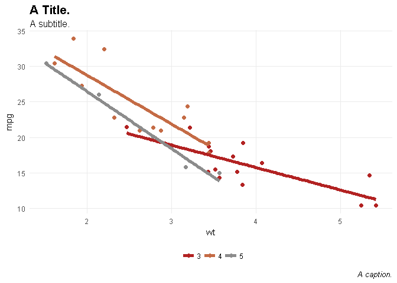
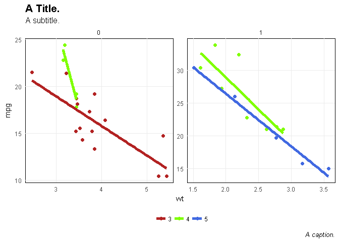
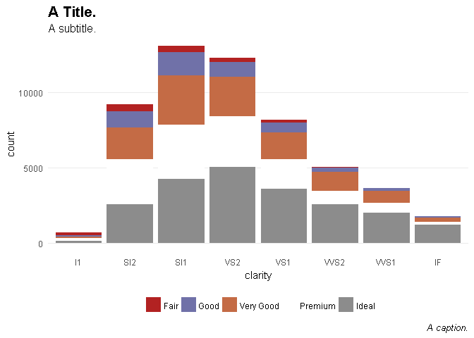
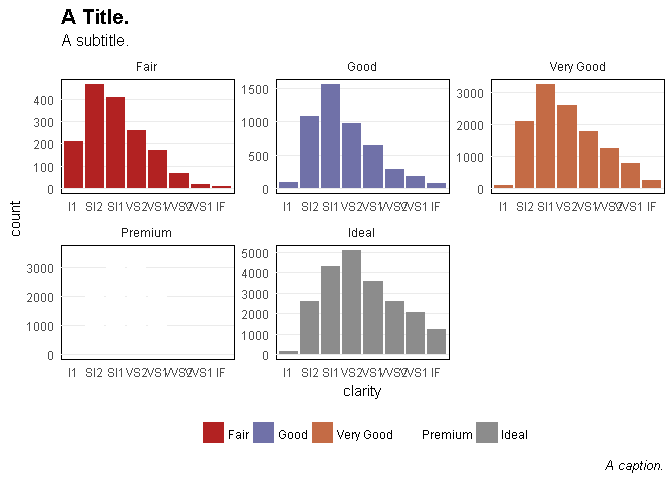

tetext 
======================================================

Introduction
------------

This package containts functions that I often use.

### Installation

`devtools::install_github("tonyelhabr/teplot")`.

Notes
-----

Here is a list of all functions in the package.

Examples
--------

``` r
library("ggplot2")
library("datasets")

viz_labs <-
  labs(
    title = "A Title.",
    subtitle = "A subtitle.",
    caption = "A caption."
  )

viz_cars <-
  ggplot(data = mtcars, aes(x = wt, y = mpg, color = factor(gear))) +
  geom_point(size = 2) +
  geom_smooth(method = "lm", se = FALSE, size = 2) +
  teplot::scale_color_te() +
  viz_labs

viz_cars_facet <-
  viz_cars +
  facet_wrap(~ am, scales = "free")

viz_diamonds <-
  ggplot(data = diamonds, aes(x = clarity, fill = color)) +
  geom_bar() +
  # scale_fill_manual(values = scales::hue_pal()(5)) +
  teplot::scale_fill_te() +
  viz_labs

viz_iris <-
  ggplot(data = iris, aes(x = Sepal.Length, y = Sepal.Width, fill = Petal.Length)) +
  geom_tile() +
  teplot::scale_fill_te(palette = "cool", discrete = FALSE) +
  teplot::theme_te_a()

viz_diamonds_facet <-
  viz_diamonds +
  facet_wrap(~ cut, scales = "free")

# viz_iris <-
#   ggplot(iris, aes(x = Species, y = Sepal.Length, fill = Species)) +
#   geom_col() +
#   viz_labs

# viz_cars + theme_grey()
viz_cars + theme_te()
```



``` r
# viz_cars + theme_te(option = "b")

# viz_cars_facet + theme_grey()
viz_cars_facet + theme_te_facet()
```



``` r
# viz_cars_facet + theme_te_facet(option = "b")

# viz_diamonds + theme_grey()
viz_diamonds + theme_te_dx()
```



``` r

# viz_diamonds_facet + theme_grey()
viz_diamonds_facet + theme_te_facet_dx()
```


