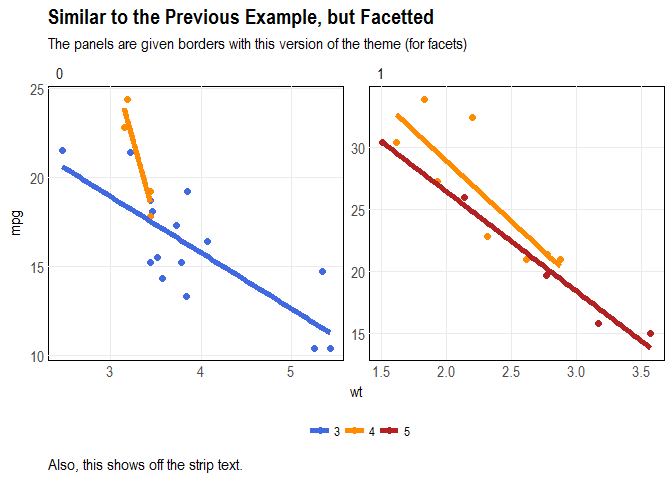
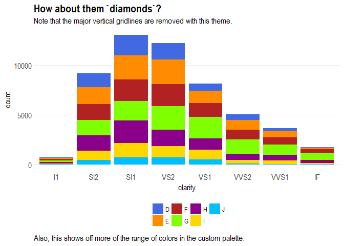
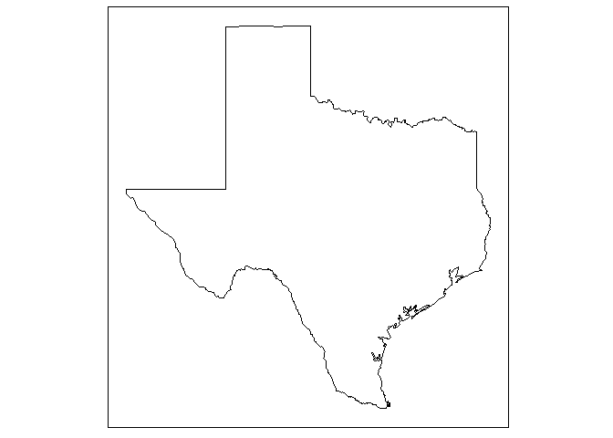

tetext 
======================================================

Introduction
------------

This package containts functions that I often use.

### Installation

`devtools::install_github("tonyelhabr/teplot")`.

Notes
-----

Here is a list of all functions in the package.

    #>  [1] "convert_state_abb_to_name" "create_map_base"          
    #>  [3] "create_map_base_tx"        "create_map_state"         
    #>  [5] "get_color_inv"             "get_map_data_county"      
    #>  [7] "get_map_data_county_tx"    "get_map_data_state"       
    #>  [9] "get_map_data_state_tx"     "ggmap_stamen_tx"          
    #> [11] "ggmap_stamen_tx_raw"       "labs_xy_null"             
    #> [13] "scale_color_te"            "scale_fill_te"            
    #> [15] "scale_x_pretty_comma"      "scale_x_pretty_percent"   
    #> [17] "scale_xy_pretty_comma"     "scale_xy_pretty_percent"  
    #> [19] "scale_y_pretty_comma"      "scale_y_pretty_percent"   
    #> [21] "spdf_tx"                   "spdf_tx_precip"           
    #> [23] "te_colors"                 "theme_map"                
    #> [25] "theme_te"                  "theme_te_dx"              
    #> [27] "theme_te_facet"            "theme_te_facet_dx"        
    #> [29] "tmap_tx"

Examples
--------

### `theme_te*()` and `te_colors`

Here are some examples showing my custom theme and color palette.

``` r
library("teplot")
library("ggplot2")
library("datasets")

viz_cars <-
  ggplot(data = mtcars, aes(x = wt, y = mpg, color = factor(gear))) +
  geom_point(size = 2) +
  geom_smooth(method = "lm", se = FALSE, size = 2)
# viz_cars + theme_grey()
viz_cars +
  teplot::scale_color_te() +
  teplot::theme_te() +
  labs(title = "Yet another `mtcars` Example",
      subtitle = "Just showing off the custom theme.",
      caption = "And the custom colors.")
```


``` r

viz_cars_facet <-
  viz_cars +
  facet_wrap( ~ am, scales = "free")
# viz_cars_facet + theme_grey()
viz_cars_facet +
  teplot::scale_color_te() +
  teplot::theme_te_facet() +
  labs(title = "Similar to the Previous Example, but Facetted",
       subtitle = "The panels are given borders with this version of the theme (for facets)",
       caption = "Also, this shows off the strip text.")
```



``` r
  
viz_diamonds <-
  ggplot(data = diamonds, aes(x = clarity, fill = color)) +
  geom_bar()
# viz_diamonds + theme_grey()
viz_diamonds +
  teplot::scale_fill_te() +
  teplot::theme_te_dx() +
  labs(title = "How about them `diamonds`?",
       subtitle = "Note that the major vertical gridlines are removed with this theme.",
       caption = "Also, this shows off more of the range of colors in the custom palette.")
```



``` r

viz_diamonds_facet <-
  viz_diamonds +
  facet_wrap( ~ cut, scales = "free")

# viz_diamonds_facet + theme_grey()
viz_diamonds_facet +
  teplot::scale_fill_te() +
  teplot::theme_te_facet_dx() +
  labs(title = "`diamond`, Facetted",
       subtitle = "This version of the theme combines the modifications of the `_facet` and `_dx` versions.",
       caption = "The vibrant colors still 'pop' off the page, even with a facetted plot.")
```


``` r

# viz_diamonds_facet + theme_grey()
# viz_iris + teplot::scale_fill_te(palette = "cool", discrete = FALSE) + teplot::theme_te()
```

Here are some examples showing the map functions.

``` r
teplot::create_map_state(state = "texas", show_county = FALSE) +
  teplot::theme_map() +
  labs(title = "Texas", 
       subtitle = "Is a Big State",
       caption = "And it's more urban than most tourists probably realize.")
```


``` r
teplot::create_map_base(state = "texas")
```



(Credit to <https://journal.r-project.org/archive/2013-1/kahle-wickham.pdf> for the data for the following example.)

``` r
library("ggmap")
crime <- ggmap::crime
ggmap_stamen_tx <- teplot::ggmap_stamen_tx

ggmap_stamen_tx +
  geom_point(data = crime, aes(x = lon, y = lat), color = "red", size = 1)
```


(Credit to <https://mgimond.github.io/Spatial/interpolation-in-r.html> for the data for the following example.)

``` r
library("tmap")
spdf_tx_precip <- teplot::spdf_tx_precip
spdf_tx <- teplot::spdf_tx
tmap::tm_shape(spdf_tx) +
  tmap::tm_polygons(col = "white", alpha = 0) +
  tmap::tm_shape(spdf_tx_precip) +
  tmap::tm_dots(
    col = "Precip_in",
    # palette = "RdBu",
    auto.palette.mapping = FALSE,
    title = "Sampled precipitation \n(in inches)",
    size = 0.7
  )
```


